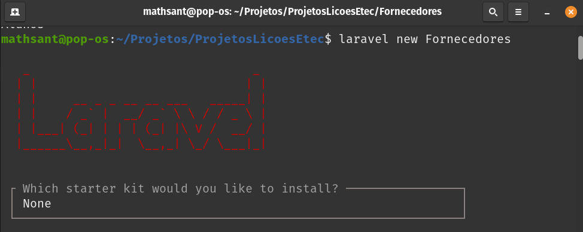
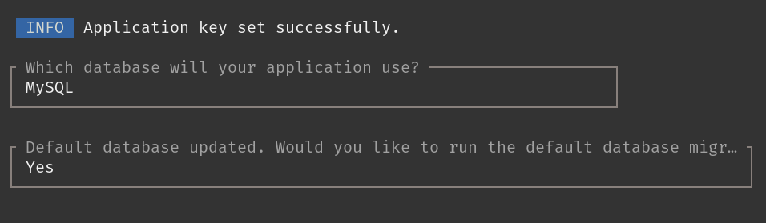
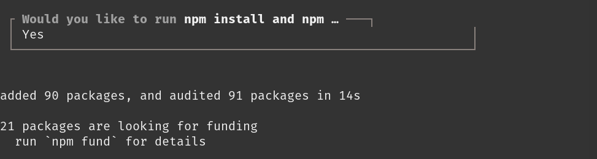
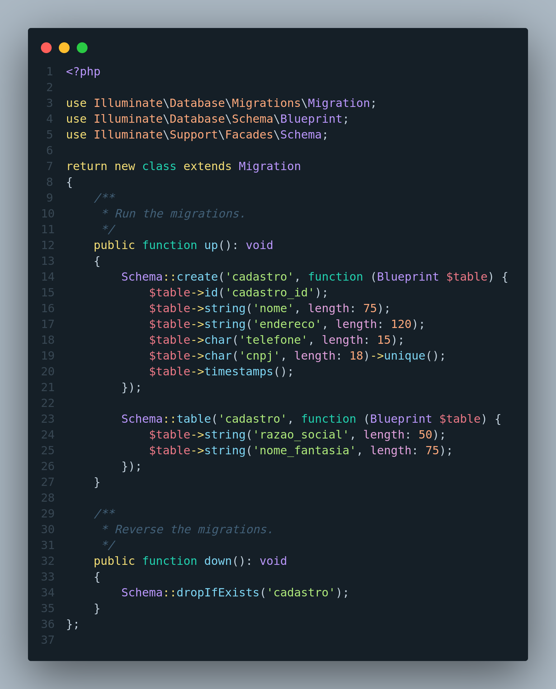
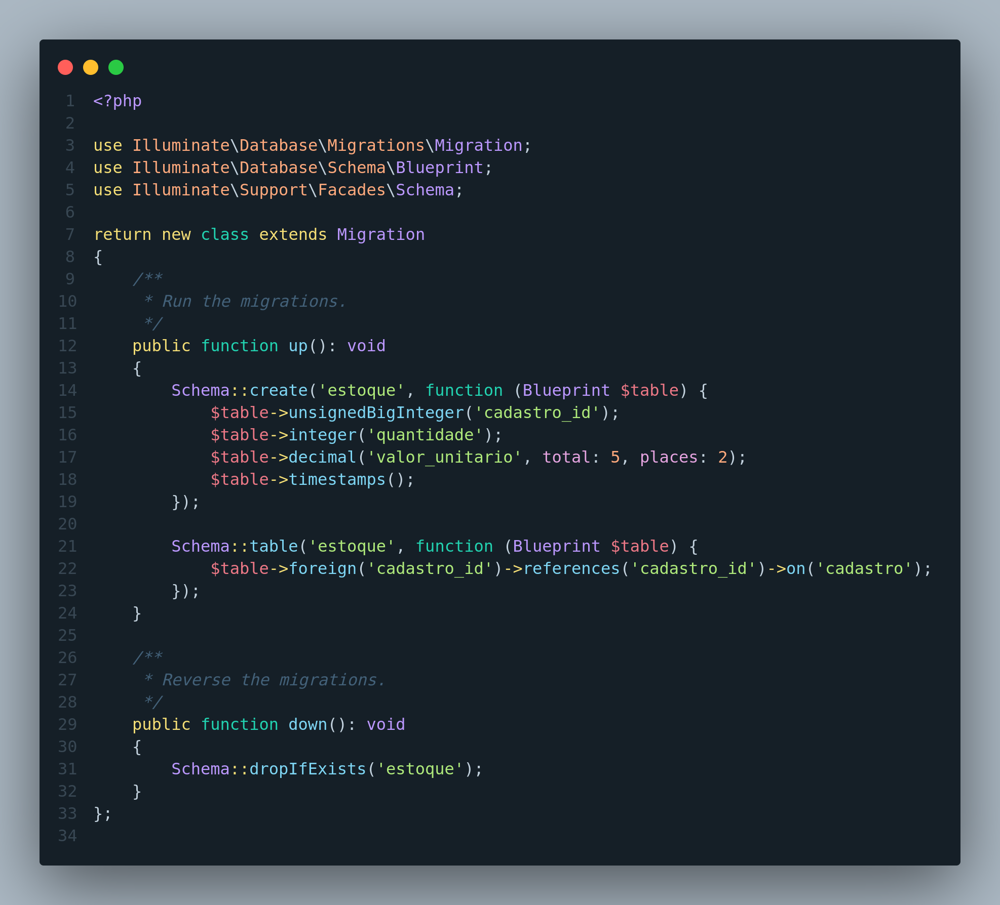
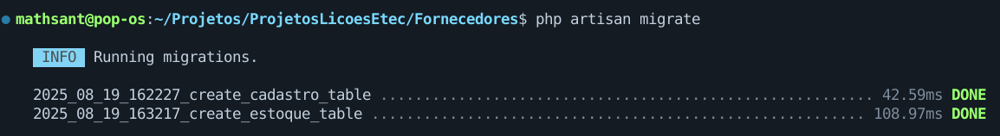
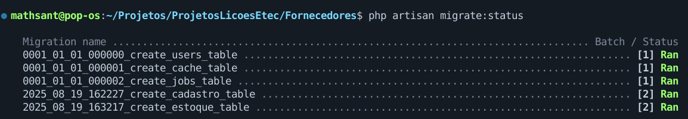

# Atividade 2 - Migrate - Chave Primária e Estrangeira e Alter Table (Matheus Jorge Santana)

Aqui você poderá ver como eu criei esse projeto e sobre a documentação do Laravel

## Requisitos para usar o Laravel

- Composer instalado - [Composer Download](https://getcomposer.org/)
- PHP instalado - [PHP Download](https://www.php.net/)
- NPM e Node instalado - [NPM e Node Download](https://nodejs.org/pt)
- Laravel instalado - [Laravel Download](https://laravel.com/docs/12.x)
- MySQL (caso você opte por ele) - [MySQL Download](https://www.mysql.com/downloads/)
- IDE para poder codar - __VS Code é recomendado__ [VS Code Download](https://code.visualstudio.com/)

_Você pode baixar o Composer e o PHP diretamente pelo site do [Laravel](https://laravel.com/docs/12.x)_

## Criando o projeto

- Para criar um projeto usando o Laravel rode o comando ```laravel new nome-do-projeto```

- Não usei nenhum _starter kit_, mas você pode escolher algum se você quiser :)



Após esse comando o Laravel vai lhe fazer algumas perguntas de como você quer configurar o seu projeto.

-----------

### Escolhendo o Banco de Dados

- Agora o Laravel irá perguntar qual banco de dados você quer. Para a criação desse projeto em específico eu usei o ```MySQL```, mas se você preferir/necessitar de outro banco de dados não tem problema nenhum.
  
- Ele também pergunta se você quer fazer as migrations que vem por padrão, escolha _Yes_ para facilitar o processo.

___Atenção! Caso você não tenha o MySQL instalado na sua máquina o projeto não irá rodar! - [Link de Instalação do MySQL](https://www.mysql.com/downloads/)___



-----------

### Rodando comandos NPM (Node Package Manager)

- O Laravel pergunta se você quer rodar os comandos ```npm run build && npm run dev```, selecione _Yes_.
  
    - ```npm run build``` serve para compilar os arquivos frontend (CSS, JS, etc.) para produção.
      
    - ```npm run dev``` serve para iniciar o ambiente de desenvolvimento. Podendo ativar o ___hot reload___ (atualiza automaticamente o navegador quando você salva um arquivo) e permitindo desenvolvimento com feedback rápido.
      
- _Caso não apareça a opção de rodar os comandos, simplesmente digite eles no terminal e os rode_



-----------

### Rodando o projeto

- Digite o comando ```cd nome-do-projeto``` para entrar no diretório do projeto
  
- Digite o comando ```composer run dev``` para rodar o projeto.
  
    - Esse comando roda uma série de outros comandos que basicamente liga todo o ambiente de desenvolvimento Laravel. Você pode verificar os comandos especificamente no arquivo ```composer.json```.
        
        - Backend
        - Filas de jobs
        - Monitoramento de logs
        - Frontend  

-----------

## Mexendo com o SQL

Aqui criaremos a nossa migration e adicionaremos algumas colunas a nossa tabela.

### Criando as migrations

Agora vamos criar uma migration, as migrações são basicamente como um controle de versão para o seu banco de dados, permitindo que sua equipe defina e compartilhe a definição de esquema do banco de dados do aplicativo.

- Para fazer uma migration digite o comando ```php artisan make:migration create_cadastro_table```
  
    - O _create_ e o _table_ antes e depois de _cadastro_ servem para que o _php_ entenda que queremos criar uma tabela com o nome _cadastro_
    
    - Criamos a tabela _estoque_ também 
  
    - Após esse comando um arquivo de migration será criado dentro do diretório migrations. Caminho do arquivo: ```database/migrations```.


-----------

### Adicionando colunas as nossas tabelas

Agora colocaremos algumas colunas a nossa tabela para vermos como o Laravel trabalha com os tipos e nomes das colunas.

- Coloquei as seguintes colunas:

**Cadastro**

    - cadastro_id > ```id (PRIMARY KEY AUTO INCREMENT)```
    - nome > ```String (VARCHAR(15))```
    - endereco > ```String (VARCHAR(120))```
    - telefone > ```char (CHAR(15))```
    - cnpj > ```char (CHAR(18)) UNIQUE - (Nenhuma outra empresa pode ter o mesmo CNPJ)```



**Estoque**
  
    - cadastro_id > ```id (FOREIGN KEY (cadastro_id) REFERENCES Cadastro)```
    - quantidade > ```INTEGER (INT)```
    - valor_unitario > ```Decimal (DECIMAL(5, ))```

- Código completo abaixo:



-----------

### Usando o Alter Table

Quando queremos adicionar colunas em uma tabela existente temos que usar o ```Schema::table```. Se você percebeu a print do código da tabela _cadastro_ tinha uma parte debaixo fora da criação das tabelas. Ali foram adicionadas duas novas colunas a tabela _cadastro_

**Cadastro**

    - razao_social > ```String (VARCHAR(50))```
    - nome_fantasia > ```String (VARCHAR(75))```


### Rodando as nossas migrations

Após criarmos e modificarmos a tabela, agora colocaremos a nossa migration para funcionar.

- Digite o comando ```php artisan migrate```. Esse comando irá rodar todas as _migrations_ disponíveis de acordo com as _migrations_ que criamos.



- Podemos ver o status das ```migrations``` com o comando ```php artisan migrate:status```



-----------

## Conclusão

Vemos que poderoso framework é o Laravel, conseguimos criar um banco de dados, tabelas e colunas, sem precisar escrever uma instrução SQL. Assim, acelerando em muito o desenvolvimento de aplicações Web e garantindo uma qualidade muito superior em relação a outras tecnologias do mercado. Agradeço pela a sua atenção e esforço de ter lido até aqui, espero que você tenha aprendido mais um pouco de como desenvolver aplicações Web com Laravel. Tenha um ótimo dia 😄!

_A partir daqui é as informações do Laravel que vem por padrão em todo projeto criado com o framework._

-----------

<p align="center"><a href="https://laravel.com" target="_blank"></a></p>

<p align="center">
<a href="https://github.com/laravel/framework/actions"></a>
<a href="https://packagist.org/packages/laravel/framework"></a>
<a href="https://packagist.org/packages/laravel/framework"></a>
<a href="https://packagist.org/packages/laravel/framework"></a>
</p>

## About Laravel

Laravel is a web application framework with expressive, elegant syntax. We believe development must be an enjoyable and creative experience to be truly fulfilling. Laravel takes the pain out of development by easing common tasks used in many web projects, such as:

- [Simple, fast routing engine](https://laravel.com/docs/routing).
- [Powerful dependency injection container](https://laravel.com/docs/container).
- Multiple back-ends for [session](https://laravel.com/docs/session) and [cache](https://laravel.com/docs/cache) storage.
- Expressive, intuitive [database ORM](https://laravel.com/docs/eloquent).
- Database agnostic [schema migrations](https://laravel.com/docs/migrations).
- [Robust background job processing](https://laravel.com/docs/queues).
- [Real-time event broadcasting](https://laravel.com/docs/broadcasting).

Laravel is accessible, powerful, and provides tools required for large, robust applications.

## Learning Laravel

Laravel has the most extensive and thorough [documentation](https://laravel.com/docs) and video tutorial library of all modern web application frameworks, making it a breeze to get started with the framework.

You may also try the [Laravel Bootcamp](https://bootcamp.laravel.com), where you will be guided through building a modern Laravel application from scratch.

If you don't feel like reading, [Laracasts](https://laracasts.com) can help. Laracasts contains thousands of video tutorials on a range of topics including Laravel, modern PHP, unit testing, and JavaScript. Boost your skills by digging into our comprehensive video library.

## Laravel Sponsors

We would like to extend our thanks to the following sponsors for funding Laravel development. If you are interested in becoming a sponsor, please visit the [Laravel Partners program](https://partners.laravel.com).

### Premium Partners

- **[Vehikl](https://vehikl.com)**
- **[Tighten Co.](https://tighten.co)**
- **[Kirschbaum Development Group](https://kirschbaumdevelopment.com)**
- **[64 Robots](https://64robots.com)**
- **[Curotec](https://www.curotec.com/services/technologies/laravel)**
- **[DevSquad](https://devsquad.com/hire-laravel-developers)**
- **[Redberry](https://redberry.international/laravel-development)**
- **[Active Logic](https://activelogic.com)**

## Contributing

Thank you for considering contributing to the Laravel framework! The contribution guide can be found in the [Laravel documentation](https://laravel.com/docs/contributions).

## Code of Conduct

In order to ensure that the Laravel community is welcoming to all, please review and abide by the [Code of Conduct](https://laravel.com/docs/contributions#code-of-conduct).

## Security Vulnerabilities

If you discover a security vulnerability within Laravel, please send an e-mail to Taylor Otwell via [taylor@laravel.com](mailto:taylor@laravel.com). All security vulnerabilities will be promptly addressed.

## License

The Laravel framework is open-sourced software licensed under the [MIT license](https://opensource.org/licenses/MIT).
